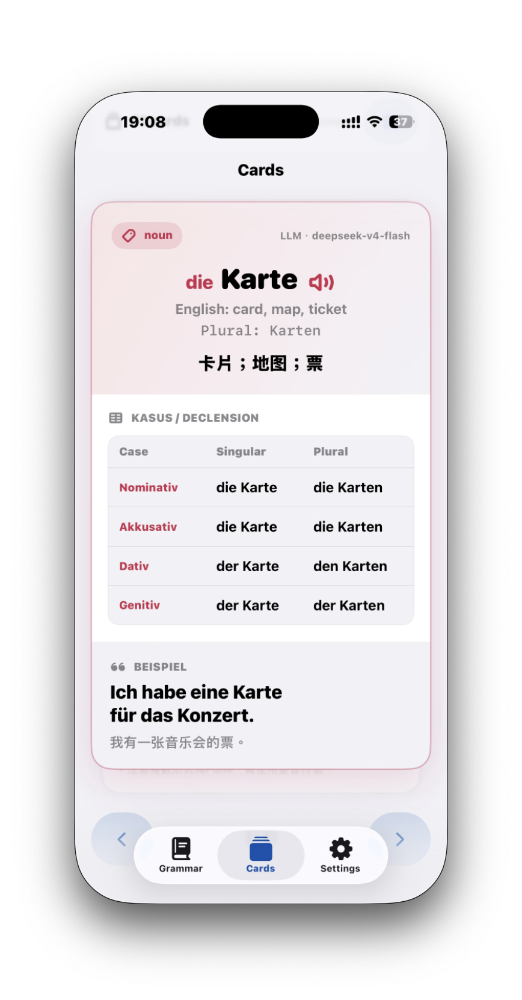
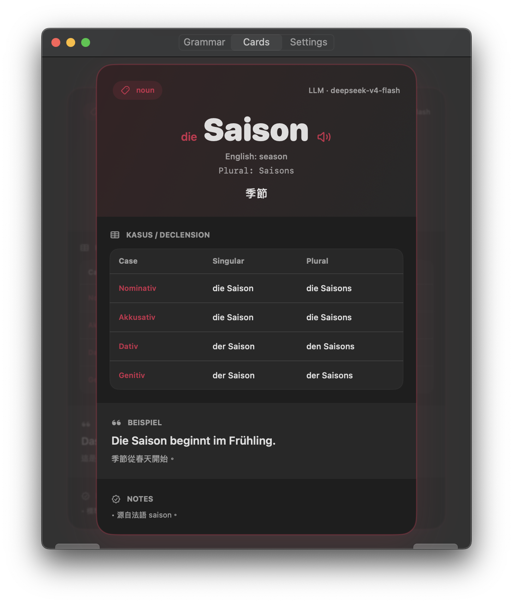

# GermanCards

SwiftUI app for German vocabulary cards and grammar references.

Cards can use the system speech synthesizer to read German words aloud for pronunciation practice.

## Demo

| iPhone | macOS |
| --- | --- |
|  |  |

## Supported Platforms

GermanCards supports iPhone and iPad, and can also run on macOS as a Mac Catalyst app. The same local user dictionary can be exported and imported across devices.

## CI Build

This repo builds iOS and Mac Catalyst on GitHub Actions with `macos-15` and Xcode 16.x:

```bash
xcodebuild \
  -project GermanCards.xcodeproj \
  -scheme GermanCards \
  -configuration Debug \
  -destination 'generic/platform=iOS' \
  CODE_SIGNING_ALLOWED=NO \
  build
```

The workflow also creates an unsigned Mac Catalyst `.app` zip and `.dmg` artifact for desktop testing. These artifacts are not notarized App Store releases; macOS may require allowing the app manually from Privacy & Security.


## User Dictionary

GermanCards does not ship a third-party dictionary. Generated cards are stored as the user's own local dictionary. Use Settings to export or import `GermanCardsDictionary.json` through Files, AirDrop, Git, or your own cloud storage.


## Local Signing

Personal signing values are kept out of git. For local iPhone installs, copy the example file and edit your team ID:

```bash
cp Config/Signing.example.xcconfig Config/Signing.local.xcconfig
```

`Config/Signing.local.xcconfig` is ignored by git. Do not put private keys, provisioning profiles, or App Store Connect credentials in tracked files.
